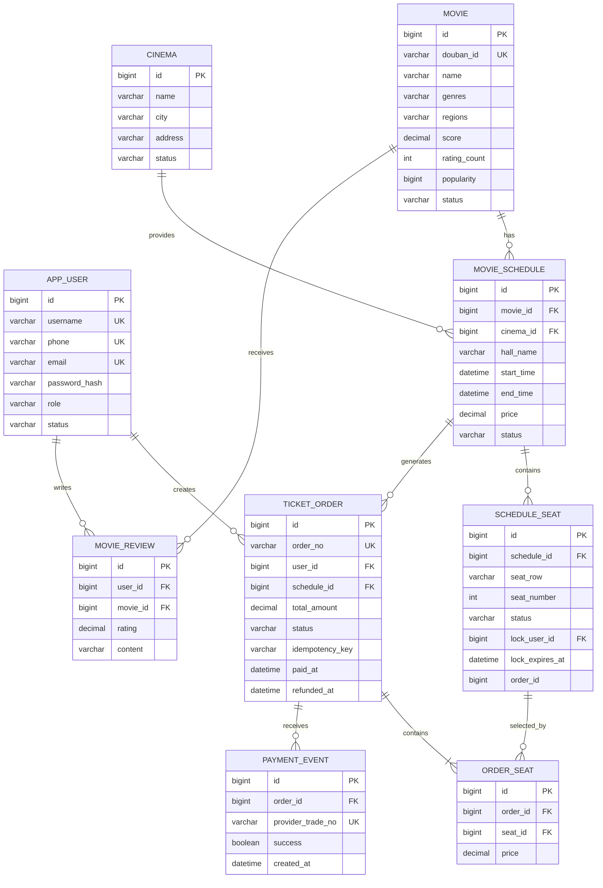
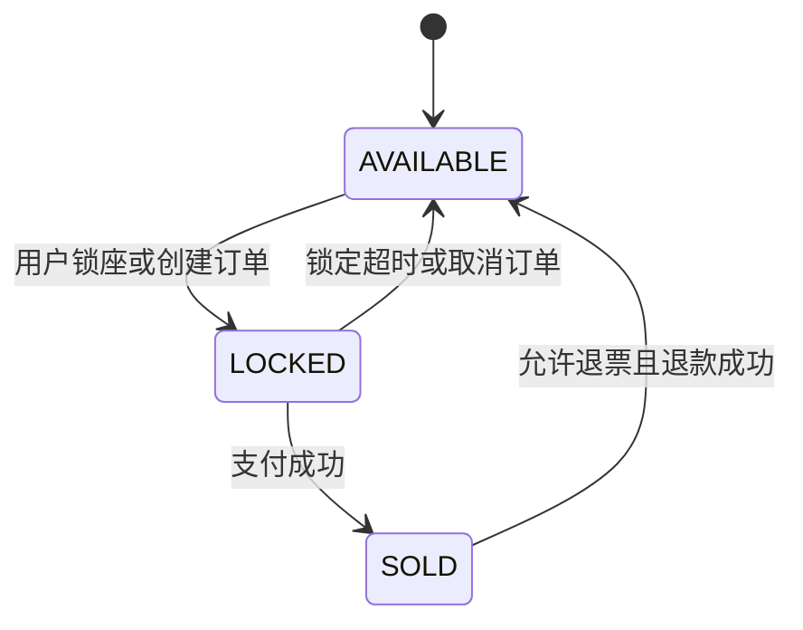
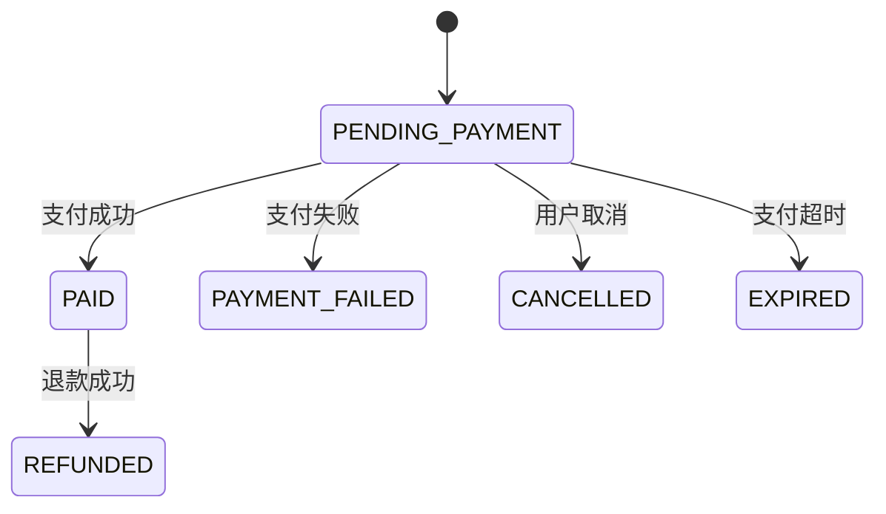

# CineFlowAPI 数据库设计说明

## 1. 文档目标

本文档用于指导 `CineFlowAPI（影流电影票务与推荐系统）` 的数据库建设，覆盖以下业务：

- 用户注册、登录与权限控制；
- 电影查询、筛选、详情和热门榜单；
- 影院、场次和座位管理；
- 锁座、购票订单、支付、取消和退款；
- 评分与评论；
- 个性化推荐；
- 电影数据统计分析；
- 自动化测试中的数据准备和数据库断言。

推荐生产环境使用 **MySQL 8.4+**，字符集使用 `utf8mb4`，默认存储引擎使用 InnoDB。开发和接口测试可以使用项目当前配置的 SQLite。

## 2. 设计原则

1. 业务数据与统计数据分离：交易相关表保持规范化，统计结果单独存储。
2. 金额统一使用 `DECIMAL`，禁止使用浮点数。
3. 所有时间字段统一保存 UTC 时间，接口层根据用户时区转换。
4. 订单、座位、支付必须通过事务和数据库约束保证一致性。
5. 关键幂等规则必须由唯一索引兜底，不能只依赖 Python 代码判断。
6. 状态字段使用稳定的英文代码，中文只用于前端展示。
7. 高频查询字段建立联合索引，避免为低区分度字段创建大量单列索引。
8. 业务记录原则上不物理删除；评论可以物理删除或增加软删除字段。

## 3. 数据库分层

| 数据层 | 主要表 | 用途 |
|---|---|---|
| 基础数据 | `app_user`、`movie`、`cinema` | 用户、电影和影院主数据 |
| 票务数据 | `movie_schedule`、`schedule_seat` | 场次库存和座位状态 |
| 交易数据 | `ticket_order`、`order_seat`、`payment_event` | 订单、订单明细和支付事件 |
| 互动数据 | `movie_review` | 用户评分与评论 |
| 分析数据 | `stat_*` | 离线或定时计算的统计结果 |

推荐模块第一版不需要单独建立推荐结果表。接口可以实时读取用户高评分电影的类型偏好，并以热门电影兜底。如果后续接入离线推荐算法，再增加 `recommendation_result` 表。

## 4. 核心实体关系



## 5. 核心业务表设计

### 5.1 用户表 `app_user`

| 字段 | 类型 | 约束 | 说明 |
|---|---|---|---|
| `id` | BIGINT | PK，自增 | 用户主键 |
| `username` | VARCHAR(32) | NOT NULL，UK | 登录用户名 |
| `phone` | VARCHAR(11) | NOT NULL，UK | 手机号 |
| `email` | VARCHAR(128) | NOT NULL，UK | 邮箱 |
| `password_hash` | VARCHAR(255) | NOT NULL | 密码哈希，禁止保存明文 |
| `role` | VARCHAR(16) | NOT NULL | `USER`、`ADMIN` |
| `status` | VARCHAR(16) | NOT NULL | `ACTIVE`、`DISABLED` |
| `created_at` | DATETIME(6) | NOT NULL | 创建时间 |
| `updated_at` | DATETIME(6) | NOT NULL | 更新时间 |

约束说明：用户名、手机号和邮箱分别建立唯一索引，用于阻止并发重复注册。

### 5.2 电影表 `movie`

| 字段 | 类型 | 约束 | 说明 |
|---|---|---|---|
| `id` | BIGINT | PK，自增 | 系统内部电影 ID |
| `douban_id` | VARCHAR(32) | UK，可空 | 数据集中的 `MOVIE_ID` |
| `name` | VARCHAR(255) | NOT NULL | 电影名 |
| `alias` | VARCHAR(255) | 可空 | 别名 |
| `actors` | TEXT | 可空 | 演员展示文本 |
| `directors` | TEXT | 可空 | 导演展示文本 |
| `cover` | VARCHAR(500) | 可空 | 封面地址 |
| `genres` | VARCHAR(255) | NOT NULL | 类型，如 `科幻/剧情` |
| `regions` | VARCHAR(255) | NOT NULL | 地区，如 `中国大陆/美国` |
| `languages` | VARCHAR(255) | 可空 | 语言 |
| `release_year` | SMALLINT | 可空 | 上映年份 |
| `release_date` | DATE | 可空 | 上映日期 |
| `mins` | SMALLINT | 可空 | 片长，单位为分钟 |
| `storyline` | TEXT | 可空 | 剧情简介 |
| `score` | DECIMAL(4,2) | NOT NULL | 当前平均分，范围 0～10 |
| `rating_count` | INT | NOT NULL | 有效评分数量 |
| `popularity` | BIGINT | NOT NULL | 热度值 |
| `status` | VARCHAR(16) | NOT NULL | `AVAILABLE`、`OFF_SHELF` |
| `created_at` | DATETIME(6) | NOT NULL | 创建时间 |
| `updated_at` | DATETIME(6) | NOT NULL | 更新时间 |

当前 Python 实体尚未保存 `douban_id`。正式导入 `movies.csv` 前建议添加此字段，否则无法稳定追踪数据集中的原始电影 ID。

推荐索引：

- `UNIQUE KEY uk_movie_douban_id (douban_id)`；
- `KEY idx_movie_filter (status, release_year, score)`；
- `KEY idx_movie_hot (status, popularity DESC, score DESC)`；
- 如果电影数量达到十万级且类型筛选频繁，建议将类型拆为 `genre`、`movie_genre` 两张关系表，避免 `%关键词%` 查询。

### 5.3 影院表 `cinema`

| 字段 | 类型 | 约束 | 说明 |
|---|---|---|---|
| `id` | BIGINT | PK，自增 | 影院 ID |
| `name` | VARCHAR(128) | NOT NULL | 影院名称 |
| `address` | VARCHAR(255) | NOT NULL | 详细地址 |
| `city` | VARCHAR(64) | NOT NULL | 城市 |
| `status` | VARCHAR(16) | NOT NULL | `OPEN`、`CLOSED` |
| `created_at` | DATETIME(6) | NOT NULL | 创建时间 |
| `updated_at` | DATETIME(6) | NOT NULL | 更新时间 |

推荐索引：`KEY idx_cinema_city_status (city, status)`。

### 5.4 电影场次表 `movie_schedule`

| 字段 | 类型 | 约束 | 说明 |
|---|---|---|---|
| `id` | BIGINT | PK，自增 | 场次 ID |
| `movie_id` | BIGINT | FK，NOT NULL | 电影 ID |
| `cinema_id` | BIGINT | FK，NOT NULL | 影院 ID |
| `hall_name` | VARCHAR(64) | NOT NULL | 影厅名称 |
| `start_time` | DATETIME(6) | NOT NULL | 开场时间 |
| `end_time` | DATETIME(6) | NOT NULL | 结束时间 |
| `price` | DECIMAL(10,2) | NOT NULL | 单座票价 |
| `status` | VARCHAR(16) | NOT NULL | `ON_SALE`、`STOPPED`、`FINISHED` |
| `created_at` | DATETIME(6) | NOT NULL | 创建时间 |
| `updated_at` | DATETIME(6) | NOT NULL | 更新时间 |

推荐索引：

- `KEY idx_schedule_movie_time (movie_id, status, start_time)`；
- `KEY idx_schedule_cinema_time (cinema_id, status, start_time)`。

业务约束：`end_time` 必须晚于 `start_time`，票价必须大于 0。

### 5.5 场次座位表 `schedule_seat`

每个场次生成一份独立的座位库存。不同场次即使使用同一个影厅，也必须拥有不同的座位记录。

| 字段 | 类型 | 约束 | 说明 |
|---|---|---|---|
| `id` | BIGINT | PK，自增 | 场次座位 ID |
| `schedule_id` | BIGINT | FK，NOT NULL | 所属场次 |
| `seat_row` | VARCHAR(8) | NOT NULL | 排号，如 `A` |
| `seat_number` | INT | NOT NULL | 座位序号 |
| `status` | VARCHAR(16) | NOT NULL | `AVAILABLE`、`LOCKED`、`SOLD` |
| `lock_user_id` | BIGINT | FK，可空 | 当前锁座用户 |
| `lock_expires_at` | DATETIME(6) | 可空 | 锁座到期时间 |
| `order_id` | BIGINT | 可空 | 当前关联订单 |
| `created_at` | DATETIME(6) | NOT NULL | 创建时间 |
| `updated_at` | DATETIME(6) | NOT NULL | 更新时间 |

关键约束：

- `UNIQUE KEY uk_schedule_seat (schedule_id, seat_row, seat_number)`；
- `KEY idx_seat_lock_cleanup (status, lock_expires_at)`；
- `KEY idx_seat_order (order_id)`。

`order_id` 可以添加到 `ticket_order.id` 的外键，但会形成订单和座位间的双向依赖。若希望简化迁移和批量清理，可以仅保留普通索引，由事务逻辑维护一致性。

### 5.6 订单表 `ticket_order`

| 字段 | 类型 | 约束 | 说明 |
|---|---|---|---|
| `id` | BIGINT | PK，自增 | 订单 ID |
| `order_no` | VARCHAR(40) | NOT NULL，UK | 对外订单号 |
| `user_id` | BIGINT | FK，NOT NULL | 下单用户 |
| `schedule_id` | BIGINT | FK，NOT NULL | 场次 ID |
| `total_amount` | DECIMAL(10,2) | NOT NULL | 下单时的总金额快照 |
| `status` | VARCHAR(24) | NOT NULL | 订单状态 |
| `idempotency_key` | VARCHAR(64) | NOT NULL | 客户端幂等键 |
| `paid_at` | DATETIME(6) | 可空 | 支付成功时间 |
| `refunded_at` | DATETIME(6) | 可空 | 退款完成时间 |
| `created_at` | DATETIME(6) | NOT NULL | 创建时间 |
| `updated_at` | DATETIME(6) | NOT NULL | 更新时间 |

关键约束：

- `UNIQUE KEY uk_order_no (order_no)`；
- `UNIQUE KEY uk_user_idempotency (user_id, idempotency_key)`；
- `KEY idx_order_user_status (user_id, status, created_at)`；
- `KEY idx_order_schedule (schedule_id)`。

### 5.7 订单座位表 `order_seat`

| 字段 | 类型 | 约束 | 说明 |
|---|---|---|---|
| `id` | BIGINT | PK，自增 | 明细 ID |
| `order_id` | BIGINT | FK，NOT NULL | 订单 ID |
| `seat_id` | BIGINT | FK，NOT NULL | 场次座位 ID |
| `price` | DECIMAL(10,2) | NOT NULL | 下单时单座价格快照 |

关键约束：

- `UNIQUE KEY uk_order_seat (order_id, seat_id)`；
- 建议再增加 `UNIQUE KEY uk_active_seat_order (seat_id)`。如果需要保留取消订单的历史占座记录，则不能直接使用该唯一索引，应增加 `active` 字段或只依赖 `schedule_seat` 的库存状态。

### 5.8 支付事件表 `payment_event`

| 字段 | 类型 | 约束 | 说明 |
|---|---|---|---|
| `id` | BIGINT | PK，自增 | 支付事件 ID |
| `order_id` | BIGINT | FK，NOT NULL | 对应订单 |
| `provider_trade_no` | VARCHAR(64) | NOT NULL，UK | 支付平台流水号 |
| `success` | BOOLEAN | NOT NULL | 回调是否表示成功 |
| `created_at` | DATETIME(6) | NOT NULL | 回调接收时间 |

生产系统建议继续增加：

- `event_type`：`PAY`、`REFUND`；
- `raw_payload`：原始回调内容；
- `signature_valid`：签名验证结果；
- `processed_status` 和 `processed_at`：事件处理状态；
- `failure_reason`：失败原因。

支付平台流水号必须唯一，以保证重复回调不会重复修改订单。

### 5.9 评分评论表 `movie_review`

| 字段 | 类型 | 约束 | 说明 |
|---|---|---|---|
| `id` | BIGINT | PK，自增 | 评论 ID |
| `user_id` | BIGINT | FK，NOT NULL | 评论用户 |
| `movie_id` | BIGINT | FK，NOT NULL | 被评论电影 |
| `rating` | DECIMAL(3,1) | NOT NULL | 评分，范围 1～10 |
| `content` | VARCHAR(1000) | NOT NULL | 评论正文 |
| `created_at` | DATETIME(6) | NOT NULL | 创建时间 |
| `updated_at` | DATETIME(6) | NOT NULL | 更新时间 |

关键约束：

- `UNIQUE KEY uk_review_user_movie (user_id, movie_id)`，一个用户对同一电影只保留一条评分；
- `KEY idx_review_movie_time (movie_id, created_at)`；
- 应用层写入前检查用户是否存在该电影的 `PAID` 订单；
- 保存或删除评论后重新计算 `movie.score` 和 `movie.rating_count`。

## 6. 状态机设计

### 6.1 座位状态



| 状态 | 含义 | 是否可被其他用户购买 |
|---|---|---|
| `AVAILABLE` | 可售 | 是 |
| `LOCKED` | 临时锁定 | 否 |
| `SOLD` | 已售 | 否 |

### 6.2 订单状态



非法状态跳转必须返回 `409 Conflict`，例如取消已支付订单、重复退款、支付已取消订单。

## 7. 锁座与下单事务设计

### 7.1 推荐事务流程

一次订单创建必须在同一数据库事务内完成：

1. 按座位 ID 升序排序，避免不同请求以不同顺序加锁造成死锁。
2. 查询场次并检查 `ON_SALE` 和开场时间。
3. 使用 `SELECT ... FOR UPDATE` 锁定本次请求的座位行。
4. 校验座位数量、所属场次和当前状态。
5. 查询 `(user_id, idempotency_key)`，已经存在则直接返回旧订单。
6. 新增 `ticket_order`。
7. 新增 `order_seat` 价格快照。
8. 将座位更新为 `LOCKED`，写入用户、订单和过期时间。
9. 提交事务。

示意 SQL：

```sql
START TRANSACTION;

SELECT id, status, lock_user_id, lock_expires_at
FROM schedule_seat
WHERE schedule_id = :schedule_id
  AND id IN (:seat_ids)
ORDER BY id
FOR UPDATE;

INSERT INTO ticket_order (...)
VALUES (...);

INSERT INTO order_seat (order_id, seat_id, price)
VALUES (...);

UPDATE schedule_seat
SET status = 'LOCKED',
    lock_user_id = :user_id,
    lock_expires_at = DATE_ADD(UTC_TIMESTAMP(6), INTERVAL 15 MINUTE),
    order_id = :order_id
WHERE id IN (:seat_ids);

COMMIT;
```

### 7.2 为什么同时需要代码校验和数据库锁

- 只在 Python 中先查再更新会产生竞态条件；
- 两个请求可能同时读到 `AVAILABLE`；
- `FOR UPDATE` 会让后到的事务等待前一个事务提交；
- 后到的事务恢复执行后会读到 `LOCKED` 或 `SOLD`，从而返回冲突；
- MySQL 必须使用 InnoDB，事务隔离级别推荐 `READ COMMITTED`。

### 7.3 超时释放

定时任务每分钟执行一次：

```sql
UPDATE ticket_order o
JOIN schedule_seat s ON s.order_id = o.id
SET o.status = 'EXPIRED', o.updated_at = UTC_TIMESTAMP(6)
WHERE o.status = 'PENDING_PAYMENT'
  AND s.status = 'LOCKED'
  AND s.lock_expires_at < UTC_TIMESTAMP(6);

UPDATE schedule_seat
SET status = 'AVAILABLE',
    lock_user_id = NULL,
    lock_expires_at = NULL,
    order_id = NULL
WHERE status = 'LOCKED'
  AND lock_expires_at < UTC_TIMESTAMP(6);
```

当前 FastAPI 代码会在座位操作和下单前释放过期锁。生产部署还应使用独立定时任务，避免长期无请求时过期记录无法及时清理。

## 8. 支付与退款一致性

支付成功回调应在一个事务内执行：

1. 校验支付平台签名；
2. 使用 `provider_trade_no` 查询是否处理过；
3. 锁定订单记录；
4. 校验订单状态必须为 `PENDING_PAYMENT`；
5. 插入 `payment_event`；
6. 更新订单为 `PAID`；
7. 更新订单关联座位为 `SOLD`；
8. 提交事务。

如果任一步骤失败，整个事务回滚。退款同样需要独立的退款流水号，生产系统不应仅凭客户端请求直接将订单置为 `REFUNDED`，而应以支付平台退款成功回调为准。

## 9. 推荐数据设计

第一阶段使用实时规则推荐，不增加新表：

1. 从 `movie_review` 查询用户评分不低于 7 分的电影；
2. 汇总对应 `movie.genres`；
3. 查询相同类型、状态为 `AVAILABLE` 且未重复的电影；
4. 结果不足时根据 `popularity` 和 `score` 使用热门电影兜底。

数据量增大后，可以增加：

```sql
CREATE TABLE recommendation_result (
    id BIGINT PRIMARY KEY AUTO_INCREMENT,
    user_id BIGINT NOT NULL,
    movie_id BIGINT NOT NULL,
    score DECIMAL(10,6) NOT NULL,
    reason VARCHAR(255) NULL,
    algorithm_version VARCHAR(32) NOT NULL,
    generated_at DATETIME(6) NOT NULL,
    expires_at DATETIME(6) NOT NULL,
    UNIQUE KEY uk_recommend_user_movie_version
        (user_id, movie_id, algorithm_version),
    KEY idx_recommend_user_score (user_id, score DESC),
    CONSTRAINT fk_recommend_user FOREIGN KEY (user_id) REFERENCES app_user(id),
    CONSTRAINT fk_recommend_movie FOREIGN KEY (movie_id) REFERENCES movie(id)
) ENGINE=InnoDB DEFAULT CHARSET=utf8mb4;
```

## 10. 统计分析表

当前项目定位是“电影购票接口自动化测试”，统计模块不再保留全部原 Java `MovieAnalysisAPI` 统计表，只保留复杂、常用、适合提前聚合的 4 张物理统计表：

| 表名 | 主维度 | 指标 |
|---|---|---|
| `stat_actor_top50` | `person_name` | `acted_movie_cnt` |
| `stat_region_year_avg_score` | `region_name + movie_year` | `region_score_avg` |
| `stat_year_region_count` | `movie_year + region_name` | `region_year_count` |
| `stat_year_top20_movie` | `movie_year + movie_id` | `name`、`douban_score`、`douban_votes` |

统计表建议由离线脚本或定时任务全量/增量刷新，不要在购票主事务中同步计算。刷新方式可以使用“临时表计算完成后原子换表”，避免接口读取到半成品数据。

以下简单统计不再建物理表：

| 已删除对象 | 当前处理方式 |
|---|---|
| `stat_genre_count` | 如需展示，可从 `movie.genres` 实时统计 |
| `stat_language` | 如需展示，可从 `movie.languages` 实时统计 |
| `stat_movie_year` | 如需展示，可按 `movie.release_year` 实时统计 |
| `stat_region_count` | 如需展示，可从 `movie.regions` 实时统计 |
| `stat_score_section` | 如需展示，可用 `CASE WHEN` 实时分段 |
| `stat_year_avg_mins` | 如需展示，可按 `movie.release_year` 实时计算平均片长 |
| `stat_region_top50` | 原本只是地区数量排序，属于重复统计 |
| `stat_high_score_avg` | 改为 `/api/stat/high-score-average` 实时查询 `movie` |
| `stat_mins_total` | 改为 `/api/stat/mins-summary` 实时查询 `movie` |

因此当前统计模块共有 6 个接口：4 个读取统计表，2 个实时读取 `movie` 表。

## 11. 数据集导入建议

现有数据集约有数百万条记录，不建议直接通过 ORM 逐行插入。

推荐流程：

1. 建立 `stg_movies`、`stg_users`、`stg_ratings`、`stg_comments` 等临时表；
2. 使用 MySQL `LOAD DATA LOCAL INFILE` 批量导入 CSV；
3. 进行空值、日期、评分和重复 ID 清洗；
4. 从临时表通过 `INSERT ... SELECT` 写入正式表；
5. 分批创建或启用索引；
6. 执行行数、空值率、重复数和抽样一致性校验；
7. 生成统计表；
8. 导入完成后归档或删除临时表。

原始用户数据只有脱敏 ID 和昵称，不能直接作为可登录用户。建议建立独立的历史评论用户映射，或者给 `app_user` 增加 `external_user_md5` 字段，并将此类用户标记为不可登录。

## 12. 自动化测试数据库设计

接口自动化测试应使用独立数据库，例如 `cineflow_test`，禁止连接开发或生产库。

建议测试策略：

- 每次测试会话创建一套基础数据；
- 每条测试使用独立用户名、手机号、邮箱和幂等键；
- 订单链路测试完成后通过事务回滚或固定清理脚本恢复数据；
- 并发抢座测试必须连接 MySQL，因为 SQLite 无法完整模拟 InnoDB 行锁；
- 数据库断言使用主键、订单号或幂等键定位数据，避免使用“最新一条记录”；
- 测试失败时保留订单号、座位 ID、支付流水号和 SQL 查询结果。

关键数据库断言示例：

```sql
-- 创建订单后应只有一条订单
SELECT COUNT(*)
FROM ticket_order
WHERE user_id = :user_id
  AND idempotency_key = :idempotency_key;

-- 支付成功后订单和座位状态必须一致
SELECT o.status AS order_status, s.status AS seat_status
FROM ticket_order o
JOIN order_seat os ON os.order_id = o.id
JOIN schedule_seat s ON s.id = os.seat_id
WHERE o.id = :order_id;

-- 电影评分与评论聚合结果一致
SELECT m.score, m.rating_count,
       AVG(r.rating) AS actual_avg,
       COUNT(r.id) AS actual_count
FROM movie m
LEFT JOIN movie_review r ON r.movie_id = m.id
WHERE m.id = :movie_id
GROUP BY m.id;

-- 推荐结果中不得包含下架电影
SELECT COUNT(*)
FROM movie
WHERE id IN (:recommended_movie_ids)
  AND status <> 'AVAILABLE';
```

## 13. MySQL 初始化建议

```sql
CREATE DATABASE IF NOT EXISTS cineflow_db
    CHARACTER SET utf8mb4
    COLLATE utf8mb4_0900_ai_ci;

CREATE USER IF NOT EXISTS 'cineflow'@'%'
    IDENTIFIED BY 'replace-with-strong-password';

GRANT SELECT, INSERT, UPDATE, DELETE
ON cineflow_db.* TO 'cineflow'@'%';
```

应用运行账号不建议拥有 `DROP`、`ALTER` 或全局权限。数据库结构变更应由单独的迁移账号执行。

对应环境变量：

```text
DATABASE_URL=mysql+pymysql://cineflow:密码@127.0.0.1:3306/cineflow_db?charset=utf8mb4
```

## 14. 迁移与版本管理

当前项目通过 SQLAlchemy `Base.metadata.create_all()` 自动建表，适用于开发演示。生产环境建议：

1. 引入 Alembic；
2. 将 `AUTO_CREATE_TABLES` 设置为 `false`；
3. 每次模型变化生成迁移文件；
4. 迁移文件与代码一起提交；
5. CI 中先对空数据库执行完整迁移，再运行接口测试；
6. 生产发布前备份数据库并验证回滚脚本。

建议迁移顺序：

```text
app_user / movie / cinema
    ↓
movie_schedule
    ↓
schedule_seat / ticket_order
    ↓
order_seat / payment_event / movie_review
    ↓
stat_* / recommendation_result（可选）
```

## 15. 当前代码与推荐设计的差异

| 项目 | 当前实现 | 推荐生产方案 |
|---|---|---|
| 建表方式 | `create_all()` | Alembic 版本化迁移 |
| 默认数据库 | SQLite | MySQL 8.4+ InnoDB |
| 电影外部 ID | 未保存 | 增加唯一 `douban_id` |
| 类型和地区 | 分隔字符串 | 数据量大时拆分关系表 |
| 锁释放 | 请求触发 | 请求触发 + 独立定时任务 |
| 支付回调 | JWT 用户鉴权演示 | 支付平台签名验证和事件审计 |
| 退款 | 接口内直接完成 | 支付平台异步退款回调确认 |
| 推荐结果 | 实时规则计算 | 大规模场景增加离线结果表 |
| 时间 | 无时区 DATETIME | 明确约定 UTC 并统一转换 |

## 16. 实施优先级

建议按以下顺序落地：

1. 完成核心 9 张业务表和外键、唯一索引；
2. 使用 MySQL 验证锁座和并发下单；
3. 引入 Alembic 管理结构；
4. 增加 `movie.douban_id` 并导入电影数据；
5. 建立统计数据生成任务；
6. 增加支付签名、退款事件和审计字段；
7. 数据规模增长后再拆分电影类型、地区和推荐结果表。

这套设计可以支持当前 FastAPI 接口，也能为后续 pytest 数据库断言与并发抢座、JMeter 性能压测、推荐算法和统计分析提供稳定的数据基础。
