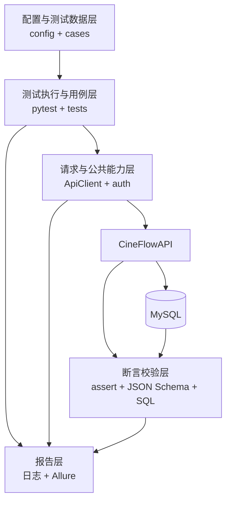
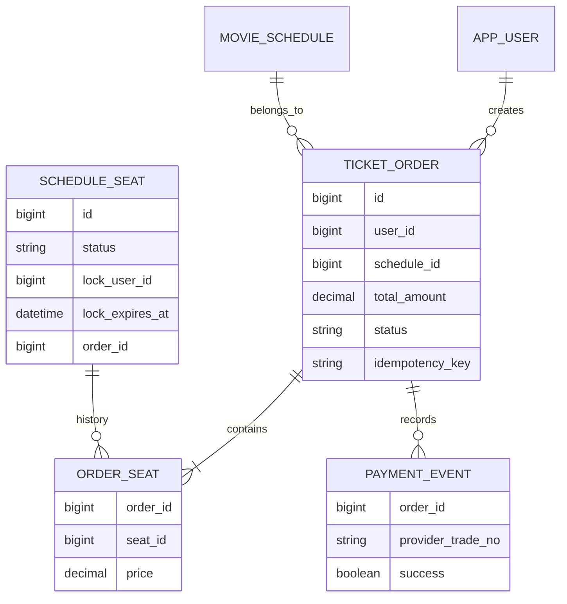

# CineFlow API 自动化测试工程零基础技术文档

> 适合读者：第一次接触接口、Python、pytest、数据驱动、JSON Schema、数据库断言、并发测试、Allure 和 JMeter 的同学。
>
> 阅读目标：读完后，你应该能回答三个问题：这个工程为什么这样分层；一条用例从哪里开始、经过哪些代码、最后怎样判定通过；遇到失败时应该去哪里排查。

---

## 0. 先把最重要的话说清楚

这个工程的名字是 `CineFlowAutoTest`，它测试的是旁边的 `CineFlowAPI` 后端。

它不是后端代码本身，也不是浏览器页面测试。它扮演的是一个“自动操作员”加“自动检查员”：

1. 自动向后端发送 HTTP 请求；
2. 自动携带参数、JSON 请求体和 JWT；
3. 自动读取后端响应；
4. 自动检查状态码、业务码、字段内容和 JSON 结构；
5. 必要时直接查询数据库，检查订单、座位和支付记录；
6. 把请求、响应和失败信息保存到 Allure 结果中；
7. 使用 JMeter 进行独立的性能测试。

一句话概括：

> 这是一个用 Python、pytest 和 requests 编写的接口自动化测试工程，通过普通 Python 用例和 YAML 数据驱动用例验证电影票务系统的接口、业务流程与数据库状态。

当前源码的真实规模是：

| 项目 | 当前数量 | 统计口径 |
|---|---:|---|
| pytest 收集后的接口用例 | 29 条 | 包含参数化展开后的 6 条统计接口用例和 9 条 YAML 用例 |
| Python 显式 `assert` | 69 条 | `tests` 目录 58 条，`common` 公共模块 11 条 |
| YAML 数据驱动用例 | 9 条 | 认证 2 条、电影 3 条、统计 4 条 |
| JSON Schema | 3 份 | 通用响应、电影列表、订单响应 |
| 通用 YAML 断言操作符 | 6 种 | equals、not_empty、contains、gte、lte、unique |

注意：69 是代码中写出的 `assert` 语句数，不等于一次运行真正执行了 69 次断言。参数化、函数复用、条件分支和测试提前失败都会改变实际执行次数。

### 0.1 边读边看的源码入口

不要只看文档。建议打开下面的文件对照阅读：

- [请求客户端](D:/MovieTicketingAndRecommendationSystem/CineFlowAutoTest/common/api_client.py)
- [fixture 和测试初始化](D:/MovieTicketingAndRecommendationSystem/CineFlowAutoTest/tests/conftest.py)
- [YAML 数据解析](D:/MovieTicketingAndRecommendationSystem/CineFlowAutoTest/common/data.py)
- [公共断言](D:/MovieTicketingAndRecommendationSystem/CineFlowAutoTest/common/assertions.py)
- [完整购票链路](D:/MovieTicketingAndRecommendationSystem/CineFlowAutoTest/tests/test_ticket_flow.py)
- [双用户抢座](D:/MovieTicketingAndRecommendationSystem/CineFlowAutoTest/tests/test_concurrent_booking.py)
- [JMeter 性能计划](D:/MovieTicketingAndRecommendationSystem/CineFlowAutoTest/performance/cineflow-api-performance.jmx)
- [100 用户报告统计](D:/MovieTicketingAndRecommendationSystem/CineFlowAutoTest/reports/jmeter/20260917-184121/html/statistics.json)

---

## 1. 先理解什么是“接口”

### 1.1 把接口想成餐厅服务窗口

你去餐厅点餐：

- 你说“我要一份炒饭”，相当于发送请求；
- 服务员听懂并把订单交给厨房，相当于服务端接收请求；
- 厨房制作并返回炒饭，相当于服务端返回响应；
- 你检查是不是炒饭、数量是否正确、有没有变质，相当于测试断言。

HTTP 接口也是同样的过程，只不过双方传递的是数据。

例如登录接口：

```text
请求方法：POST
请求地址：/api/auth/login
请求体：{"username": "test_user", "password": "Test1234"}
```

后端可能返回：

```json
{
  "code": 0,
  "message": "success",
  "data": {
    "token": "一段JWT字符串",
    "tokenType": "Bearer"
  },
  "timestamp": 1789640000000
}
```

测试不能只看“有返回”。至少要继续问：

- HTTP 状态码是不是 200？
- `code` 是不是 0？
- `token` 是否存在？
- `tokenType` 是否为 Bearer？
- 整个 JSON 结构是否符合接口契约？

### 1.2 常见 HTTP 方法

| 方法 | 通俗理解 | 项目示例 |
|---|---|---|
| GET | 查询数据 | 查询电影、订单、推荐结果 |
| POST | 创建资源或执行动作 | 注册、登录、创建订单、支付、退款 |
| PUT | 创建或整体更新某项业务数据 | 创建或更新电影评价 |
| DELETE | 删除资源 | 删除评价 |

方法名字表达的是接口意图，但真正的业务行为还要看服务端实现。例如 POST 通常不是天然幂等，但项目的下单接口通过幂等键实现了部分幂等能力。

### 1.3 HTTP 状态码和业务码不是一回事

HTTP 状态码是网络协议层面的结果：

- 200：请求成功；
- 201：资源创建成功；
- 400：请求参数或业务条件错误；
- 401：没有有效登录身份；
- 403：已经登录，但没有权限；
- 404：资源不存在；
- 409：业务冲突，例如座位已经被占用；
- 422：请求字段未通过模型校验；
- 500：服务端未处理的异常。

项目响应体里还有 `code`，它属于业务码。测试通常需要两层都检查：

```python
assert response.status_code == 403
assert response.json()["code"] == 403
```

如果只看 HTTP 200，而响应体里 `code=500`，仍然不能认为业务成功。

---

## 2. 为什么要做接口自动化

手工用 Postman 调一次接口很容易，但完整回归会遇到这些问题：

- 接口数量越来越多；
- 同一个接口有正常、异常、权限和边界场景；
- 下单需要先登录、查电影、查场次、查座位；
- 支付完成后还要查订单和数据库；
- 每次改代码都要重新检查；
- 人工容易漏步骤、抄错 ID、忘记清理数据。

自动化测试把步骤写成程序。只要环境和数据满足条件，它就可以重复执行同一套检查。

接口自动化最适合检查：

- 输入参数与返回结果；
- 身份认证和权限；
- 业务状态变化；
- 接口之间的数据传递；
- 数据库最终状态；
- 幂等与并发；
- 快速回归。

接口自动化不等于万能测试。它不能直接证明：

- 页面样式和用户点击体验正确；
- 真实支付渠道已经到账；
- 系统一定能承受几万真实用户；
- 没有任何安全漏洞；
- 所有未写进断言的字段都正确。

---

## 3. 技术栈逐个解释

| 技术 | 它负责什么 | 在本工程中的位置 |
|---|---|---|
| Python | 编写测试程序 | 所有 `.py` 文件 |
| pytest | 收集、组织和执行测试 | `tests/`、`pytest.ini` |
| requests | 发送 HTTP 请求 | `common/api_client.py` |
| YAML | 保存环境配置和数据驱动用例 | `config/`、`cases/` |
| JSON Schema | 校验响应 JSON 的结构和类型 | `schemas/` |
| SQLAlchemy | 连接数据库并执行查询 | `common/db.py` |
| PyMySQL | SQLAlchemy 连接 MySQL 使用的驱动 | `requirements.txt` |
| Allure | 保存和展示测试步骤、附件及结果 | `api_client.py`、pytest 配置 |
| Docker Compose | 一次启动 MySQL、API 和测试容器 | `docker-compose.yml` |
| JMeter | 执行性能测试 | `performance/` |
| Postman | 人工调试和验证接口 | 独立使用，不是 pytest 执行器 |

### 3.1 pytest 是什么

pytest 是测试执行器。它主要负责：

- 找到所有测试函数；
- 准备 fixture；
- 运行测试；
- 判断成功、失败、跳过或错误；
- 展示断言失败；
- 把结果交给 Allure 插件。

一个最简单的 pytest 用例：

```python
def test_addition():
    actual = 1 + 1
    assert actual == 2
```

函数名以 `test_` 开头，pytest 才会按当前配置把它当成测试。

### 3.2 requests 是什么

requests 是 Python 的 HTTP 客户端。它相当于代码里的 Postman：

```python
import requests

response = requests.get("http://127.0.0.1:8000/api/movies")
print(response.status_code)
print(response.json())
```

工程没有在每个用例里直接重复写 requests，而是封装成了 `ApiClient`。

### 3.3 YAML 是什么

YAML 是便于人阅读的配置格式：

```yaml
base_url: http://127.0.0.1:8000
request_timeout: 10
verify_ssl: false
```

缩进表示层级，不能随便混用缩进。`false` 是布尔值，不是字符串。

### 3.4 JSON Schema 是什么

普通断言检查某个值，JSON Schema 检查一整份 JSON 的形状。

例如订单 ID 必须是正整数：

```json
{
  "type": "integer",
  "minimum": 1
}
```

它能发现字段缺失、类型错误、非法枚举和多余字段等问题，但不能单独证明“订单金额算对了”。

### 3.5 Allure 是什么

pytest 负责执行，Allure 负责把结果变得容易看。

本工程会在每次请求时保存：

- 请求方法和路径；
- 请求参数或 JSON；
- 响应状态码；
- 响应正文。

pytest 先生成 Allure 原始结果，Allure CLI 再把它们生成可浏览报告。

---

## 4. 工程目录逐层认识

```text
CineFlowAutoTest/
├─ cases/                  YAML 数据驱动用例
│  ├─ auth_cases.yaml
│  ├─ movie_cases.yaml
│  └─ stat_cases.yaml
├─ common/                 可复用的公共能力
│  ├─ api_client.py        HTTP 请求封装
│  ├─ assertions.py        公共断言
│  ├─ auth.py              登录并设置 JWT
│  ├─ config.py            环境配置读取
│  ├─ data.py              YAML、变量和简单 JSON 路径
│  └─ db.py                数据库查询封装
├─ config/
│  └─ test_env.yaml        默认测试环境
├─ llm/                    可选的大模型辅助工具
├─ performance/            JMeter 性能测试计划与脚本
├─ schemas/                JSON Schema 文件
├─ scripts/
│  └─ wait_for_api.py      Docker 环境中等待 API 就绪
├─ tests/                  pytest 测试代码
│  ├─ conftest.py          fixture 与公共初始化
│  ├─ test_auth_api.py
│  ├─ test_movie_api.py
│  ├─ test_recommendation_api.py
│  ├─ test_stat_api.py
│  ├─ test_ticket_flow.py
│  ├─ test_concurrent_booking.py
│  └─ test_data_driven.py
├─ docker-compose.yml      MySQL + API + 测试的容器编排
├─ Dockerfile              测试容器构建方式
├─ pytest.ini              pytest 配置
└─ requirements.txt        Python 依赖清单
```

如果你刚开始学习，先只记住四个目录：

- `tests`：写测试流程；
- `common`：写重复使用的工具；
- `cases`：写 YAML 测试数据；
- `schemas`：写响应结构规则。

---

## 5. 五层框架到底是哪五层

所谓“五层”是职责分层，不代表一定有五个完全同名目录。



### 5.1 配置与数据层

职责：告诉测试“去哪里请求、用什么账号、输入什么、期望什么”。

相关文件：

- `config/test_env.yaml`
- `.env`
- `cases/*.yaml`
- `common/config.py`
- `common/data.py`

### 5.2 请求与公共能力层

职责：统一发送 GET、POST、PUT、DELETE，统一加请求头、超时和 JWT。

相关文件：

- `common/api_client.py`
- `common/auth.py`
- `common/db.py`

### 5.3 业务用例层

职责：组织操作顺序，描述“我要验证什么业务”。

例如购票用例的顺序：

```text
找电影 → 找场次 → 找座位 → 创建订单 → 重复下单
→ 支付 → 重复支付 → 评价 → 推荐 → 删除评价 → 退款
```

相关文件：`tests/test_*.py`。

### 5.4 断言校验层

职责：比较实际结果和期望结果。

包含：

- HTTP 状态码断言；
- 业务码断言；
- 字段值断言；
- JSON Schema；
- 数据库断言；
- 幂等与并发结果断言。

### 5.5 执行与报告层

职责：收集用例、准备 fixture、分组运行、记录结果。

相关内容：

- `pytest.ini`
- `tests/conftest.py`
- Allure 插件
- 日志

---

## 6. 一条普通接口用例是怎么跑起来的

以电影分页边界为例：

```python
def test_page_size_boundary(client):
    assert client.get("/api/movies", params={"pageSize": 100}).status_code == 200
    assert client.get("/api/movies", params={"pageSize": 101}).status_code == 400
```

从执行命令开始，发生了这些事情：

1. 你运行 `pytest`；
2. pytest 根据 `pytest.ini` 去 `tests` 目录寻找 `test_*.py`；
3. pytest 找到 `test_page_size_boundary`；
4. 它看到函数需要参数 `client`；
5. pytest 去 `conftest.py` 找同名 fixture；
6. `client` fixture 读取 `settings`，创建 `ApiClient`；
7. 用例通过 `client.get()` 发送请求；
8. ApiClient 使用 requests 发出真实 HTTP 请求；
9. 服务端返回 Response；
10. `assert` 比较实际状态码和期望状态码；
11. 用例结束后 fixture 关闭 Session；
12. pytest 和 Allure 保存结果。

页面大小 100 应允许，101 应拒绝。这叫边界值测试：不只测一个正常值，还测允许范围的边界和刚刚越界的值。

---

## 7. 配置加载：测试到底连到哪里

默认配置文件是：

```yaml
base_url: http://127.0.0.1:8000
database_url: sqlite:///../CineFlowAPI/cineflow.db
request_timeout: 10
verify_ssl: false
test_user:
  username: test_user
  password: Test1234
admin_user:
  username: admin
  password: Admin123
```

`common/config.py` 把它读成一个不可变的 `Settings` 对象。

### 7.1 配置优先级

接口工程大致按下面的优先级取值：

```text
已经存在的进程环境变量
        ↓
.env 中加载出来的变量
        ↓
TEST_CONFIG 指定的 YAML
        ↓
代码默认值
```

例如设置：

```powershell
$env:BASE_URL = "http://192.168.1.50:8000"
```

那么它会覆盖 YAML 中的 `http://127.0.0.1:8000`。

### 7.2 为什么不把真实密码写进代码

代码会进入版本库，报告可能被上传，真实账号密码写进去容易泄露。实际环境应通过 `.env` 或 CI Secret 注入。

当前请求附件的脱敏能力并不完整，因此在完善工程时还要给密码、Token、Cookie、数据库连接串做递归脱敏。

### 7.3 `BASE_URL` 有没有 `/api`

当前用例自己写 `/api/...`，所以 `BASE_URL` 是：

```text
http://127.0.0.1:8000
```

不要写成：

```text
http://127.0.0.1:8000/api
```

否则实际地址可能变成 `/api/api/movies`。

---

## 8. ApiClient：为什么要封装 requests

核心思想：重复的事情只写一次。

如果不封装，每条用例都要重复：

```python
requests.get(
    "http://127.0.0.1:8000/api/movies",
    timeout=10,
    verify=False,
    headers={"Accept": "application/json"},
)
```

封装后只需要：

```python
client.get("/api/movies")
```

### 8.1 构造方法做了什么

`ApiClient.__init__()` 保存：

- `base_url`：服务地址；
- `timeout`：请求超时；
- `verify_ssl`：是否校验证书；
- `session`：requests 会话对象。

Session 可以复用连接、公共请求头和 Cookie。它不是登录用户本身，真正的身份来自 Authorization Token。

### 8.2 `set_token()` 做了什么

有 Token 时：

```text
Authorization: Bearer <token>
```

会被写进 Session 的公共 Header。

传入 None 时移除 Authorization，客户端重新成为未认证状态。

### 8.3 `request()` 做了什么

步骤如下：

1. 把相对路径拼成完整 URL；
2. 填入默认超时和 SSL 配置；
3. 记录请求日志；
4. 创建 Allure 步骤；
5. 附加请求数据；
6. 使用 Session 发请求；
7. 附加响应正文；
8. 返回 Response 给用例判断。

请求层没有统一执行 `raise_for_status()`，这是正确的基本方向。因为测试错误密码时，401 正是预期结果，不能被请求层提前当成程序错误吞掉。

### 8.4 当前实现需要注意什么

- `timeout=10` 不是严格的完整业务墙钟时限；
- `verify_ssl=false` 适合当前本地环境，不是生产安全默认值；
- 请求和响应附件可能包含密码、Token，需要完善脱敏；
- `clone()` 创建的是新客户端，没有复制原 Token 和 Cookie；
- 订单 POST 不应该无条件自动重试，必须保留原幂等键并先判断结果。

---

## 9. fixture：pytest 怎样帮你准备环境

fixture 可以理解为“测试前自动准备、测试后自动收拾”的方法。

### 9.1 settings fixture

```python
@pytest.fixture(scope="session")
def settings() -> Settings:
    return Settings.load()
```

`scope="session"` 表示整个 pytest 会话只加载一次配置，因为配置对象是只读的，不需要每条用例重新读文件。

### 9.2 client fixture

```python
@pytest.fixture
def client(settings):
    result = ApiClient(...)
    yield result
    result.session.close()
```

`yield` 前是准备阶段，`yield` 后是清理阶段。

每条用例得到一个新的 client，避免上一条用例修改 Token 后污染下一条用例。

### 9.3 auth_client fixture

```python
@pytest.fixture
def auth_client(client, settings):
    login(client, settings.test_username, settings.test_password)
    return client
```

它依赖 `client`，先调用登录接口，再把 JWT 放到这个客户端中。需要登录的用例声明 `auth_client`，不需要登录的用例使用 `client`。

### 9.4 database fixture

如果配置了数据库地址，它创建数据库访问对象；如果没有配置，它返回 None。

当前购票用例使用：

```python
if database:
    # 执行数据库断言
```

这意味着没有数据库配置时，接口用例仍可能通过，但数据库检查没有执行。因此报告“本次完成数据库一致性验证”时，必须确认数据库 fixture 确实启用。更严格的做法是把数据库一致性场景拆成数据库必需用例，缺配置就明确失败或跳过。

### 9.5 `serial` 标记不会自动串行

当前 `@pytest.mark.serial` 只是标签。它告诉人“这个用例有共享状态，应该串行”，但 pytest 本身不会因为这个标签自动加锁。

如果未来安装并行插件，可以分两次运行：

```powershell
pytest -m "not serial" -n auto
pytest -m serial
```

第二次不启用并行。两次结果要分别保存，或者采用清晰的合并方案。

---

## 10. 普通 Python 用例逐模块解释

### 10.1 认证与权限：`test_auth_api.py`

#### 注册、登录、重复注册

测试流程：

```text
生成随机用户名、手机号、邮箱
        ↓
注册，期望 201
        ↓
检查返回用户名
        ↓
用新账号登录，期望 200 和非空 Token
        ↓
再次注册相同信息，期望 409
```

为什么要随机数据？因为用户名、手机号、邮箱有唯一约束。如果每次都用同一个新用户，第二次运行第一次注册就会失败。

随机数据也不是百分之百不会冲突。当前使用截断 UUID 和手机号取模，概率很低但不是数学上绝对唯一。测试失败时要保留本次生成值，才能判断是碰撞还是产品问题。

#### 缺少和伪造 Token

同一个测试先不带 Token 访问订单，期望 401；然后设置一个明显非法的 Token，再访问，仍然期望 401。

这验证了两个不同风险：

- 根本没有认证凭证；
- 客户端提供了伪造或格式错误的凭证。

#### 普通用户访问后台

先使用普通用户登录，再请求 `/api/admin/health`，期望 403。这是纵向越权测试：身份是真的，但权限级别不够。

### 10.2 电影查询：`test_movie_api.py`

它覆盖：

- 类型和地区筛选；
- 最低评分筛选；
- 电影详情；
- 热门电影去重；
- 下架状态过滤；
- pageSize 的 100/101 边界。

下面这个断言非常重要：

```python
assert movies
```

因为：

```python
all(condition for item in [])
```

结果是 True。如果没有先断言列表非空，接口错误地返回空列表时，后面的“所有结果都是科幻片”仍可能通过，这叫空集合假通过。

推荐模块目前只检查去重和在售，没有先检查非空。是否应该补非空要看前置测试数据和业务规则，不能所有推荐场景都强制非空。

### 10.3 推荐：`test_recommendation_api.py`

包含：

- 无需登录的热门推荐；
- 登录后的个人推荐；
- limit=51 的越界检查。

当前公共检查只验证：

- HTTP 200；
- 电影 ID 不重复；
- 所有电影状态为 AVAILABLE。

它还不能证明推荐内容真的符合用户偏好。要验证推荐规则，需要准备一组可人工推导的数据：用户评价了哪些类型、哪些电影已经评价、候选电影有哪些、热门补足顺序是什么。

### 10.4 统计接口：`test_stat_api.py`

`STAT_PATHS` 有 6 个接口，下面的参数化：

```python
@pytest.mark.parametrize("path", STAT_PATHS)
def test_statistics_are_available(client, path):
    ...
```

虽然源码只有一个函数，pytest 会展开成 6 条测试实例。这就是“参数化”。

当前主要检查统计接口可用、业务码为 0、data 不为 None，以及少量筛选字段。它没有全面核对统计数值。要证明统计正确，应使用固定小样本手算或独立 SQL 聚合。

### 10.5 未登录创建订单

向 `/api/orders` 发送请求但不带 Token，期望 401。这条用例很小，但价值明确：交易接口必须要求身份。

---

## 11. 完整购票链路逐步拆开

文件：`tests/test_ticket_flow.py`。

### 11.1 先找一个真的可以买的座位

辅助方法 `_available_show_and_seat()` 做三层查找：

```text
查询符合条件的电影
    ↓
逐部电影查询未来在售场次
    ↓
逐个场次查询座位
    ↓
返回第一个 AVAILABLE 座位
```

如果没有电影，直接断言失败；如果有电影但没有可售场次或座位，用例会 skip。

skip 不是 passed。报告中应该单独展示，否则可能出现核心交易链路根本没执行，却被描述成“全量通过”。

### 11.2 创建订单

请求体：

```python
payload = {
    "scheduleId": schedule["id"],
    "seatIds": [seat["id"]],
    "idempotencyKey": key,
}
```

检查内容：

- HTTP 201；
- 响应符合 `order.schema.json`；
- 订单状态为 `PENDING_PAYMENT`。

### 11.3 重复下单的幂等检查

使用完全相同的请求体和幂等键再次请求，期望：

- 仍然得到成功结果；
- 返回的订单 ID 和第一次一致。

幂等的含义不是“第二次请求一定报错”，而是同一个业务操作重试不会重复产生副作用。

当前场景只验证顺序重试，还没有覆盖两个相同幂等键请求同时到达的竞争窗口。

### 11.4 下单后的数据库检查

启用 database fixture 后检查：

```sql
SELECT status, idempotency_key
FROM ticket_order
WHERE id = :id
```

应该得到：

```python
{"status": "PENDING_PAYMENT", "idempotency_key": key}
```

同时检查座位表状态是 `LOCKED`。

注意数据库查询必须使用响应中的订单 ID，不能查询“最新一条订单”。多人并发运行时，最新一条很可能属于别人。

### 11.5 支付与重复支付

第一次支付使用随机 `providerTradeNo`，期望：

- HTTP 200；
- 订单状态 PAID。

再使用相同交易号回调一次，期望仍返回 200。最后数据库检查该交易号只有一条 `payment_event`，说明重复回调没有重复写事件。

这属于模拟支付业务状态验证，不等于接入了真实第三方支付渠道，也不能证明实际资金到账。

### 11.6 评价与评分边界

支付完成后创建 9.0 分评价，期望成功；然后提交 11 分，期望 422，因为评分超出允许范围。

这同时验证：

- 购票用户可以评价；
- 请求模型拒绝越界评分。

### 11.7 推荐、删除评价和退款

个人推荐检查结果去重和在售；删除刚创建的评价，期望 204；最后退款，订单状态变为 REFUNDED。

启用数据库检查后还会验证：

- 订单表为 REFUNDED；
- 座位恢复 AVAILABLE；
- 锁用户、锁过期时间和当前订单归属被清空；
- 同一支付交易号只有一条事件。

### 11.8 长链路的优缺点

优点：能证明多个接口可以串起来完成核心业务。

缺点：如果下单阶段失败，支付、评价和退款都不会执行。报告只显示这一条 E2E 失败，不能说明后面的所有能力各自失败。

所以合理的测试组合是：

- 保留一条完整 E2E；
- 为支付、退款、非法状态等重要规则另写可独立准备前置的用例。

---

## 12. 并发抢座到底怎么测

文件：`tests/test_concurrent_booking.py`。

### 12.1 业务目标

两个不同用户同时购买同一个座位，合理结果是：

- 一个请求成功创建订单，HTTP 201；
- 另一个发生资源冲突，HTTP 409；
- 不能出现两个有效订单同时占有同一座位。

### 12.2 为什么创建两个独立用户

如果两个线程共用同一个用户，服务端可能把它理解成当前用户对自己的锁继续操作，无法证明用户隔离。

测试因此为每一方：

- 注册不同账号；
- 创建独立 ApiClient；
- 获取独立 JWT；
- 使用不同幂等键。

### 12.3 ThreadPoolExecutor 做什么

它创建两个 Python 工作线程。HTTP 请求主要在等待网络和服务端响应，因此线程适合这里的 I/O 并发。

### 12.4 Barrier 做什么

```python
barrier = Barrier(2)
```

两个线程先都执行到 `barrier.wait()`，都准备好以后再继续发请求。

它只能让客户端线程的起点更接近，不能保证两个数据库事务同一微秒开始。网络、连接建立和服务端调度仍然会造成先后。

### 12.5 当前断言能证明到哪里

当前主要断言是：

```python
assert sorted(response.status_code for response in responses) == [201, 409]
```

这能证明两条 HTTP 响应符合预期，但还不够完整。完善时应该在清理前继续查询：

- 本轮两个幂等键一共生成几条有效订单；
- 成功订单是否关联目标座位；
- 座位当前 `order_id` 是否指向赢家；
- 失败用户是否留下残余订单或票项。

### 12.6 为什么只在 MySQL 环境执行

代码依赖 MySQL/InnoDB 的行锁语义。SQLite 的并发写和 `SELECT ... FOR UPDATE` 行为不等价，不能拿 SQLite 通过结果证明 MySQL 抢座正确。

### 12.7 两个用户不等于几万客户

双用户用例验证的是特定资源冲突下的正确性，不是容量。

大规模测试至少要分开：

- 很多用户抢同一座位：验证热点竞争、防超卖和可控冲突；
- 很多用户购买不同座位：验证系统整体吞吐、连接池和数据库能力。

---

## 13. YAML 数据驱动从零解释

普通 Python 用例适合复杂流程，YAML 适合“请求一次、检查一次”的大量简单场景。

### 13.1 一条 YAML 用例长什么样

```yaml
cases:
  - name: 登录成功并返回JWT
    request:
      method: POST
      path: /api/auth/login
      json:
        username: ${test_username}
        password: ${test_password}
    expect:
      status: 200
      code: 0
      schema: envelope.schema.json
      checks:
        - {path: $.data.token, op: not_empty}
        - {path: $.data.tokenType, op: equals, value: Bearer}
```

分成两个核心块：

- `request`：怎么请求；
- `expect`：期望什么。

### 13.2 变量替换

`${test_username}` 不会原样发送。测试运行时会从 settings 中取得账号并替换。

完整占位符可以保留原变量类型；嵌入字符串时会转换成字符串。

当前 YAML 变量只有：

- `test_username`
- `test_password`

它没有实现任意跨用例提取，例如第一步返回 orderId、第二步自动使用。这类复杂关联目前使用 Python 用例实现。

### 13.3 YAML 怎样变成 pytest 用例

`test_data_driven.py` 在收集阶段读取固定的三个文件：

```python
CASE_FILES = [auth_cases.yaml, movie_cases.yaml, stat_cases.yaml]
```

然后：

```python
@pytest.mark.parametrize("group,case", CASES, ...)
```

把 9 个 YAML 条目展开为 9 条测试实例。

新增一个 YAML 文件不会自动执行，因为文件清单是明确写死的。需要把它加入 `CASE_FILES`，或者未来实现受控的文件发现机制。

### 13.4 六种通用断言

| 操作符 | 意思 | 例子 |
|---|---|---|
| equals | 完全相等 | 页码等于 1 |
| not_empty | 不为约定的空值 | Token 非空 |
| contains | 实际值包含期望值 | 类型包含“科幻” |
| gte | 大于或等于 | 评分不低于 8 |
| lte | 小于或等于 | 列表数量不超过 10 |
| unique | 列表中没有重复值 | 推荐电影 ID 去重 |

### 13.5 简单 JSON 路径

当前实现支持类似：

```text
$.data.token
$.data.list[0].id
```

它只是工程自己写的简化版，不是完整 JSONPath。通配符、过滤表达式、负索引、键名里带点等高级语法并不支持。

### 13.6 数据驱动不是把所有测试都写进 YAML

下列场景更适合 Python：

- 多步骤接口关联；
- 动态创建和清理资源；
- 并发；
- 复杂条件分支；
- 数据库多表核对；
- 故障注入。

不要为了“数据驱动”这个名词，把 YAML 设计成另一门难维护的编程语言。

---

## 14. 公共断言是怎么工作的

`assert_response(response, expected)` 按顺序做这些检查：

1. HTTP 状态码；
2. 把响应解析成 JSON；
3. 如果配置了业务码，就检查 `code`；
4. 如果配置了 Schema，就执行结构校验；
5. 遍历 `checks`，读取字段并执行操作符。

### 14.1 为什么检查顺序很重要

如果接口返回了 HTML 网关错误，直接取 `body["data"]` 会得到一个误导性的 JSON 解析异常。更理想的顺序是：

```text
状态码 → Content-Type → JSON解析 → Schema → 业务字段
```

当前实现还可以在 Content-Type、204 空响应和脱敏错误信息方面增强。

### 14.2 硬断言会发生什么

```python
assert actual == expected
```

失败时当前测试立即停止，后面的断言不会执行。这适合前置结构已经不满足、后续检查没有意义的情况。

如果想一次收集多个互相独立的字段错误，可以设计软断言收集器，但最后必须真正让测试失败，不能只打印日志。

### 14.3 `not_empty` 的真实含义

当前排除：

- None
- 空字符串
- 空列表
- 空字典

数值 0 和布尔 False 会通过，空集合也会通过。因此它不是通用“真值断言”。对于金额、计数和布尔字段，应使用更精确的业务规则。

---

## 15. JSON Schema 从零解释

### 15.1 为什么字段断言还不够

假设你只检查：

```python
assert body["code"] == 0
```

即使 `data` 缺失、timestamp 变成字符串、返回多出敏感字段，这条断言也可能通过。

Schema 可以统一检查整个结构。

### 15.2 通用 envelope Schema

它要求顶层必须有：

- code：整数；
- message：字符串；
- data：任意内容；
- timestamp：正整数；
- 不能有未声明的顶层字段。

`data: {}` 代表内部没有具体约束。因此它只能验证通用外壳，不能发现订单 data 里的字段缺失。

### 15.3 电影列表 Schema

它约束：

- data 是对象；
- 必须有 list、pageNum、pageSize、total、totalPages；
- list 每个元素引用 movie 定义；
- 电影必须有 id、name、genres、regions、score、status；
- status 只能为 AVAILABLE 或 OFF_SHELF。

### 15.4 订单 Schema

它要求订单包含：

- id；
- orderNo；
- userId；
- scheduleId；
- totalAmount；
- status；
- seats。

状态只能来自订单状态枚举。

当前 seats 只要求是至少一项的数组，没有约束内部每个座位对象的具体字段，因此仍有完善空间。

### 15.5 `required` 和 `properties` 的区别

`properties` 规定“字段出现时是什么样”；`required` 规定“字段必须出现”。

只写：

```json
"properties": {"id": {"type": "integer"}}
```

而不把 id 放进 required，字段完全缺失也可能合法。

### 15.6 Schema 能做什么，不能做什么

能做：

- 字段必填；
- 类型；
- 数值范围；
- 字符串长度；
- 枚举；
- 数组元素结构；
- 是否允许额外字段。

不能单独做：

- 金额是否等于票价乘座位数；
- 当前用户是否有权限；
- PAID 是否从 PENDING_PAYMENT 合法转换；
- 返回电影是否真的符合用户偏好；
- 数据库是否已经写入。

---

## 16. 数据库断言从零解释

接口响应说“成功”，不代表数据库一定正确。可能出现：

- 接口返回成功但事务未提交；
- 订单表成功，座位表没更新；
- 座位释放了，但支付事件重复；
- 查询错了另一个数据库。

### 16.1 Database 封装

提供三种方法：

| 方法 | 返回什么 | 适用场景 |
|---|---|---|
| `one()` | 一行字典或 None | 查询一个订单 |
| `all()` | 多行字典列表 | 查询一组票项 |
| `scalar()` | 单个值 | COUNT、状态等 |

SQL 使用绑定参数：

```python
database.scalar(
    "SELECT status FROM ticket_order WHERE id=:id",
    id=order_id,
)
```

不要把外部输入直接拼进 SQL 字符串。

### 16.2 项目交易涉及哪些表



`order_seat` 是历史票项关联；`schedule_seat.order_id` 表示座位当前归属。退款后历史票项仍可保留，但座位当前归属应该释放，以便未来再次出售。

### 16.3 数据库断言常见错误

- 查“最新一条”而不是本次 orderId；
- 测试 API 和 SQL 连到了不同数据库；
- 一对多 JOIN 后重复累加订单总额；
- 历史退款订单被误判成当前超卖；
- 接口读的是副本，测试没有考虑延迟；
- 没有固定查询时点，过期时间刚好跨边界。

数据库也不是天然真值。查询语句写错，同样会造成错误结论。

---

## 17. 幂等、事务和行锁用最简单的话解释

### 17.1 幂等是什么

用户点击一次下单，但网络没收到响应，于是客户端重试。如果每次都创建新订单，就可能重复占座。

幂等键相当于这次业务操作的唯一号码：

```text
同一用户 + 同一幂等键 = 同一次业务动作
```

相同键重试应该得到原订单，而不是创建新订单。

### 17.2 幂等键不能解决所有重复下单

如果客户端重试时换了一个新键，服务端就会认为是另一次业务动作。

因此还要保护资源不变量：同一座位不能同时归属两个有效订单。

当前代码有一个值得实际复现的风险：同一用户使用不同幂等键重复购买自己已经锁定的同一座位，座位校验可能没有拒绝。这是源码风险分析，必须在隔离环境复现并留证后，才能称为真实发现的 Bug。

### 17.3 事务是什么

事务可以理解为“一组数据库动作要么一起成功，要么一起失败”。

创建订单时包括：

- 写订单；
- 写订单座位关联；
- 把座位改为 LOCKED；
- 写座位当前订单归属。

如果中间一步失败，不应该留下半个订单。

### 17.4 行锁是什么

两个用户同时查到同一个 AVAILABLE 座位，都想购买。如果只“先查再写”，两边可能都认为能买。

`SELECT ... FOR UPDATE` 会在事务中锁住目标行，让另一个事务等待。第一个事务提交后，第二个事务再读取时应该看到座位已经被占用，从而返回 409。

### 17.5 为什么按座位 ID 排序

一次购买多个座位时，如果两个事务用相反顺序加锁，容易形成互相等待。统一按 ID 排序可以降低这类死锁风险，但不能消除涉及其他表和其他锁顺序的全部死锁。

---

## 18. pytest 标记和常用运行命令

当前标记：

| 标记 | 含义 |
|---|---|
| smoke | 核心冒烟用例 |
| regression | 回归用例 |
| serial | 有状态、建议串行执行 |
| mysql | 依赖 MySQL 行锁语义 |

### 18.1 全量执行

```powershell
cd D:\MovieTicketingAndRecommendationSystem\CineFlowAutoTest
.\.venv\Scripts\python.exe -m pytest -v
```

### 18.2 只运行冒烟

```powershell
.\.venv\Scripts\python.exe -m pytest -m smoke -v
```

### 18.3 只运行回归标记

```powershell
.\.venv\Scripts\python.exe -m pytest -m regression -v
```

`smoke` 和 `regression` 是独立标签。运行 `-m regression` 不会自动包含只有 smoke 标签的用例。

### 18.4 指定某个文件

```powershell
.\.venv\Scripts\python.exe -m pytest tests\test_auth_api.py -v
```

### 18.5 指定某个函数

```powershell
.\.venv\Scripts\python.exe -m pytest `
  tests\test_ticket_flow.py::test_purchase_payment_review_refund_full_flow -v
```

### 18.6 只收集，不执行

```powershell
.\.venv\Scripts\python.exe -m pytest --collect-only -q -o addopts=
```

这里覆盖默认 `addopts`，主要避免仅统计用例时清理旧 Allure 结果。收集仍会导入测试模块和 YAML，所以坏配置仍可能让收集失败。

---

## 19. 从零搭建并运行本地环境

### 19.1 准备软件

- Python 3.12；
- PyCharm 或任意编辑器；
- 可选：MySQL 8；
- 可选：Docker Desktop；
- 查看报告时需要 Allure CLI；
- 性能测试需要 Java 和 JMeter 5.6.3。

### 19.2 先启动 API

```powershell
cd D:\MovieTicketingAndRecommendationSystem\CineFlowAPI
.\.venv\Scripts\python.exe -m uvicorn app.main:app --reload
```

保持这个终端不要关闭。

浏览器访问：

```text
http://127.0.0.1:8000/health
```

确认返回成功。

### 19.3 为测试工程创建虚拟环境

新开一个 PowerShell：

```powershell
cd D:\MovieTicketingAndRecommendationSystem\CineFlowAutoTest
py -3.12 -m venv .venv
.\.venv\Scripts\python.exe -m pip install -r requirements.txt
```

虚拟环境的作用是让这个工程使用自己的依赖，不和系统其他 Python 项目互相污染。

### 19.4 创建本地配置

```powershell
Copy-Item .env.example .env
```

根据实际 API、数据库和测试账号修改 `.env`。真实密码不要提交到版本库。

### 19.5 先跑最简单的用例

```powershell
.\.venv\Scripts\python.exe -m pytest tests\test_auth_api.py -v
```

如果认证用例能运行，再执行全量。

### 19.6 使用 PyCharm

1. 打开 `CineFlowAutoTest` 目录；
2. 把解释器设为 `CineFlowAutoTest\.venv\Scripts\python.exe`；
3. 确认测试框架是 pytest；
4. 右键 `tests` 目录；
5. 选择 Run pytest。

---

## 20. Docker Compose 到底做了什么

`docker-compose.yml` 定义三个服务：

```text
mysql → api → tests
```

### 20.1 mysql 服务

- 使用 MySQL 8.4；
- 创建 `cineflow_test` 数据库；
- 宿主机通过 3307 访问；
- 容器内部仍然是 3306；
- healthcheck 等待 MySQL 可连接。

### 20.2 api 服务

- 使用 `../CineFlowAPI` 构建；
- 容器内部通过主机名 `mysql` 访问数据库；
- 自动建表和导入演示数据；
- 对宿主机开放 8000。

### 20.3 tests 服务

- 使用当前 Dockerfile 安装测试依赖；
- 通过 `http://api:8000` 请求 API；
- 通过 `mysql:3306` 查询数据库；
- 先运行 `wait_for_api.py`；
- API 健康后运行 pytest；
- 把报告映射到宿主机 `reports`。

### 20.4 为什么容器里不能写 localhost

容器中的 `localhost` 指当前容器自己。tests 容器要找 api 容器，应该用 Compose 服务名 `api`，而不是 `127.0.0.1`。

### 20.5 一次运行完整环境

```powershell
cd D:\MovieTicketingAndRecommendationSystem\CineFlowAutoTest
docker compose up --build --abort-on-container-exit --exit-code-from tests tests
```

用完以后，在确认这是可丢弃的专用测试环境时执行：

```powershell
docker compose down -v
```

`-v` 会移除该 Compose 项目管理的卷，不能照搬到共享或生产数据库。

---

## 21. Allure 报告怎样生成和查看

pytest 配置中包含：

```text
--alluredir=reports/allure-results
--clean-alluredir
```

这表示每次运行前清理旧原始结果，再写入本轮结果。

查看报告：

```powershell
allure serve reports\allure-results
```

### 21.1 报告里应该看什么

- 用例名称；
- Passed、Failed、Skipped、Broken；
- 失败阶段；
- 请求步骤；
- 请求参数；
- 响应正文；
- 断言实际值与期望值；
- 执行环境和版本。

### 21.2 “全绿”为什么不等于没有问题

可能存在：

- 核心用例被 skip；
- 没写到的场景；
- 断言过弱；
- 接错数据库；
- 只测了响应，没测副作用；
- 环境数据刚好掩盖筛选错误。

一份合格回归结论必须同时报告收集数、实际执行数、通过数、失败数、跳过数和剩余风险。

---

## 22. JMeter 性能测试从零解释

性能测试位于 `performance/`，它和 pytest 功能测试不是同一套执行器。

### 22.1 当前测试计划做什么

每个虚拟用户：

1. 登录一次；
2. 从响应中提取 JWT；
3. 循环查询电影列表；
4. 循环查询热门电影；
5. 循环查询演员 Top50；
6. 循环查询个人推荐。

四个循环接口都是只读接口，不创建订单，也不验证抢座容量。

### 22.2 当前断言

- 登录 HTTP 200；
- Token 必须存在；
- 四个业务请求 HTTP 200；
- 每个请求耗时不超过配置的 `max_response_ms`，默认 2000 ms。

耗时断言是在请求完成后判断是否超标，不是在 2 秒时主动终止请求。

### 22.3 虚拟用户不等于真实独立客户

当前所有线程默认使用同一账号密码。可以说“100 个 JMeter 虚拟用户线程”，不能说“100 个独立客户账号”。如果要测试用户隔离和不同推荐数据，应使用 CSV 提供独立账号。

### 22.4 运行方式

```powershell
Set-ExecutionPolicy -Scope Process Bypass
.\performance\run-jmeter.ps1 `
  -JMeterHome "D:\tools\apache-jmeter-5.6.3" `
  -Users 10 `
  -RampUp 10 `
  -Duration 60
```

输出：

```text
reports/jmeter/时间戳/
├─ results.jtl
└─ html/index.html
```

### 22.5 已有 100 用户报告怎样解释

本地报告记录：

| 指标 | 结果 |
|---|---:|
| 样本总数 | 36,454 |
| JMeter 错误数 | 0 |
| 平均响应时间 | 约 234.02 ms |
| P95 | 452 ms |
| P99 | 583 ms |
| 吞吐量 | 约 121.68 次/秒 |

准确表述：

> 在该次测试环境、固定只读混合场景和 100 个虚拟用户线程下，JMeter 报告记录 36,454 个请求样本，错误率 0%，平均响应约 234 ms，P95 为 452 ms，吞吐约 121.68 次/秒。

不能表述为：

> 系统可以承受几万用户购票。

原因是这轮没有压下单、支付、锁和数据库写竞争，也缺少生产硬件与真实流量模型证明。

### 22.6 平均值、P95 和吞吐量

- 平均响应时间：所有样本耗时的平均值，容易被长尾掩盖；
- P95：大约 95% 样本不超过这个耗时；
- P99：更关注慢请求尾部；
- Throughput：单位时间完成的样本数；
- Error %：JMeter 按响应与已配置断言判断的失败比例。

总 P95 不能代替单接口 P95。已有报告中个人推荐 P95 高于总 P95，关键接口应该单独看。

---

## 23. Postman 在这个项目中的位置

Postman 适合：

- 初次了解接口；
- 调试参数和 Header；
- 手工检查 Token；
- 复现某一次失败；
- 与开发快速共享请求。

pytest 适合：

- 批量回归；
- 复杂关联；
- 数据库查询；
- 自动断言；
- CI 执行。

JMeter 适合：

- 生成持续负载；
- 统计吞吐与延迟分布；
- 做阶梯、压力和稳定性测试。

三者不是互相替代，而是解决不同问题。

---

## 24. 可选 LLM 辅助模块

`llm/` 提供两个辅助功能：

- 根据接口说明生成待人工复核的 YAML；
- 根据 pytest 失败日志生成定位建议。

需要配置：

```text
LLM_API_BASE
LLM_API_KEY
LLM_MODEL
```

生成用例后会检查根节点是否为 cases，并使用现有加载器做基础校验。

大模型输出不能直接当作测试真值，原因包括：

- 可能误解业务规则；
- 可能编造不存在的字段；
- 可能漏掉重要场景；
- 同一输入可能产生不同输出。

正确用法是：模型负责起草和辅助分析，人负责确认需求、断言与最终结论。

---

## 25. 最常见的失败怎样排查

### 25.1 Connection refused

含义：地址上没有服务接受连接。

检查顺序：

1. API 是否已经启动；
2. BASE_URL 是否正确；
3. 端口是否正确；
4. 本机和容器地址是否混用；
5. 代理是否影响本地请求。

### 25.2 401

检查：

- 是否登录成功；
- Token 是否为空；
- Authorization 是否为 `Bearer <token>`；
- Token 是否过期；
- 是否被上一条用例设置成非法 Token。

function 级 client 可以减少后一种污染。

### 25.3 403

说明身份通常已经被识别，但角色没有权限。确认使用的是普通用户还是管理员，且不要只看前端按钮是否隐藏。

### 25.4 404

检查：

- URL 是否多了或少了 `/api`；
- 路径参数 ID 是否存在；
- 资源是否下架而被隐藏；
- 用户是否只能看到自己的资源。

### 25.5 409

常见含义：

- 重复注册；
- 座位冲突；
- 非法订单状态转换；
- 数据库唯一约束冲突。

在抢座场景中 409 可能是预期业务结果，不应该和 500、超时混成一种技术错误。

### 25.6 422

请求字段没有通过模型校验，例如评分 11 越界、字段类型错误、必填字段缺失。检查错误响应里的字段路径。

### 25.7 数据库查不到订单

依次检查：

1. 使用的是否是响应订单 ID；
2. API 和测试 SQL 是否连接同一个数据库；
3. 数据库名、主机、端口是否一致；
4. 事务是否提交；
5. 是否存在读副本延迟；
6. 查询是否写错表或条件。

### 25.8 Schema 失败

看两个路径：

- instance path：实际 JSON 哪里不对；
- schema path：违反了哪条规则。

当前错误信息主要拼 message，未来可以增加完整 JSON 路径，尤其是数组中第几个元素失败。

### 25.9 用例被跳过

检查 skip 原因：

- 没有 MySQL；
- 没有电影；
- 没有未来场次；
- 没有可用座位。

核心用例长期跳过不是“稳定”，而是测试数据准备不足。

---

## 26. 如何新增一条普通接口用例

假设新增“limit=0 时热门电影返回 400”。

### 第一步：明确需求

先确认接口允许范围，不要根据自己猜测写期望。

### 第二步：选择文件

电影查询放到 `tests/test_movie_api.py`。

### 第三步：写用例

```python
@pytest.mark.regression
def test_hot_movie_limit_lower_boundary(client):
    response = client.get("/api/movies/hot", params={"limit": 0})
    assert response.status_code == 400, response.text
    assert response.json()["code"] == 400
```

### 第四步：先单独运行

```powershell
pytest tests\test_movie_api.py::test_hot_movie_limit_lower_boundary -v
```

### 第五步：再运行相关模块或全量

确认没有破坏其他测试。

### 新用例检查清单

- [ ] 测试名能说明条件和期望；
- [ ] 选择了正确 fixture；
- [ ] 正常、异常或边界的分类明确；
- [ ] 断言不仅检查“有返回”；
- [ ] 有状态数据可以清理；
- [ ] 不依赖其他独立用例先运行；
- [ ] 报告不泄露密码和 Token。

---

## 27. 如何新增 YAML 用例

适合单请求场景，例如电影列表 pageNum=0。

```yaml
- name: 页码小于最小值
  request:
    method: GET
    path: /api/movies
    params:
      pageNum: 0
  expect:
    status: 400
    code: 400
    schema: envelope.schema.json
```

步骤：

1. 选择已有 YAML 文件，或创建新文件；
2. 保持两个空格缩进；
3. 写 request；
4. 写 expect；
5. 新文件加入 `CASE_FILES`；
6. 执行 `--collect-only` 确认用例被收集；
7. 单独运行参数化模块；
8. 查看 Allure 请求和响应。

YAML 当前加载器只检查 name、request、expect 三个顶层字段。完善时应该在加载阶段继续验证 method、path、status、checks 结构和操作符，避免执行时才出现 KeyError。

---

## 28. 如何新增 JSON Schema

假设增加登录响应 Schema：

1. 查看真实接口契约；
2. 明确顶层 envelope；
3. 给 data 写具体对象结构；
4. 把必须字段放入 required；
5. 决定是否禁止 additionalProperties；
6. 给 Token 写非空长度；
7. 在 YAML 或 Python 用例中调用；
8. 人为删除一个字段验证 Schema 真的会失败。

示意：

```json
{
  "$schema": "https://json-schema.org/draft/2020-12/schema",
  "type": "object",
  "required": ["code", "message", "data", "timestamp"],
  "properties": {
    "code": {"const": 0},
    "message": {"type": "string"},
    "timestamp": {"type": "integer"},
    "data": {
      "type": "object",
      "required": ["token", "tokenType", "user"],
      "properties": {
        "token": {"type": "string", "minLength": 20},
        "tokenType": {"const": "Bearer"},
        "user": {"type": "object"}
      }
    }
  }
}
```

这只是教学示意，字段必须以真实登录响应为准。

---

## 29. 一个 Bug 怎样按 STAR 法则讲

下面是根据当前源码风险设计的练习案例。只有实际复现并保存证据后，才可以说是项目中真实发现的 Bug。

### S：背景

购票系统已经通过幂等键处理相同请求重试，但用户网络卡顿或连续点击可能生成不同幂等键。我补充“同一用户、同一座位、不同幂等键重复下单”场景。

### T：任务

验证同一座位只能存在一个有效待支付订单，第二次不同业务键重复购买应被拒绝，座位归属不能被覆盖。

### A：行动

1. 用同一用户和座位以 K1 下单；
2. 再用 K2 对同一座位下单；
3. 比较两个响应订单 ID；
4. 查询 `ticket_order`、`order_seat`、`schedule_seat`；
5. 阅读 `_validate_seats()`；
6. 发现它主要拒绝“其他用户”的锁，对当前用户已经关联有效订单的座位缺少检查；
7. 建议在事务锁内检查有效订单归属，并保留相同键正常重放；前端同时禁用重复提交按钮。

### R：结果口径

理想修复验收：

- 相同键返回同一订单；
- 不同键重复买同座位返回 409；
- 数据库只有一个有效订单；
- 座位归属不变；
- 没有残余票项。

在没有实际复现和修复记录时，应说“我通过代码审查设计了这个高风险测试”，不要说“我在线上发现并推动修复了该 Bug”。

---

## 30. 当前工程的局限和合理完善顺序

### 30.1 当前局限

1. 用例规模仍属于核心流程起步阶段；
2. 只有 3 份 Schema，很多响应只检查部分字段；
3. 双用户抢座主要检查响应码，缺少同一用例里的数据库不变量核对；
4. 完整交易用例没有保证所有异常路径都独立可测；
5. 数据准备依赖现有电影、未来场次和可用座位；
6. 随机注册用户会残留；
7. 请求与响应附件的敏感信息脱敏需要完善；
8. `serial` 只是标签；
9. JMeter 是只读固定配比场景，不能代表交易容量；
10. 可选 LLM 输出仍需要人工确认。

### 30.2 推荐完善顺序

第一优先级：交易正确性。

- 同一用户不同幂等键重复购买；
- 并发相同幂等键；
- 多座位原子性；
- 已支付订单收到失败回调；
- 跨订单复用交易号；
- 过期与支付并发；
- 抢座数据库不变量。

第二优先级：测试可靠性。

- 专属测试数据准备；
- 订单和账号清理；
- 关键 skip 门禁；
- 日志和附件脱敏；
- 保存环境与版本元数据。

第三优先级：契约与覆盖。

- 按真实响应结构增加 Schema；
- 建立接口—场景—状态转换覆盖表；
- 增加错误响应 Schema；
- 加强统计和推荐业务断言。

第四优先级：性能与工程化。

- 独立账号与真实配比；
- 下单热点/非热点性能场景；
- 应用、数据库与发压机监控；
- 独立环境持续稳定性；
- 可追踪的 CI 运行记录。

目标数量可以规划为 120～180 条接口用例和约 18 份 Schema，但它们是规划，不应该在真正实现、收集和验证之前写成已完成成果。

---

## 31. 面试时怎样介绍这个框架

### 31.1 一分钟版本

> 我基于 pytest 和 requests 搭建了电影票务接口自动化工程，把配置数据、请求封装、业务用例、断言校验和执行报告分层。环境和账号由 YAML 与环境变量管理，ApiClient 统一处理 Session、超时、JWT 及 Allure 请求响应附件；简单单接口场景使用 YAML 参数化，复杂购票流程和并发场景使用 Python 编写。当前源码收集 29 条接口用例，包含 9 条 YAML 用例、3 份 JSON Schema，并通过 SQLAlchemy 查询订单、座位和支付记录。核心流程覆盖下单幂等、支付回调、评价、推荐和退款；另有两个独立用户抢同一座位的 MySQL 并发用例。JMeter 结果属于只读混合负载，我会明确它不能代表真实购票容量。

### 31.2 面试官追问“为什么要分层”

> 因为环境地址、HTTP 通信、业务步骤和判断规则的变化原因不同。分层后，地址变化只改配置，公共 Header 或超时改请求层，业务规则改测试，响应结构改 Schema，减少在几十条用例里重复修改。

### 31.3 面试官追问“怎么保证不是只检查 200”

> 我按协议、业务、契约和数据四层检查：状态码和业务码判断请求结果，字段与 JSON Schema 判断内容，订单类场景再查询数据库核对订单、座位和支付事件。并发用例当前响应检查较多，我会诚实说明还需要补同一场景的数据库不变量断言。

### 31.4 面试官追问“你发现过什么问题”

如果已经实际复现，就讲请求、数据库快照、根因和复测。如果没有证据：

> 我目前能展示的是通过代码审查识别的一个高风险场景：同一用户使用不同幂等键重复购买自己锁定的座位。现有校验主要拒绝其他用户的锁，我已经设计了接口和三表核对步骤，但在正式复现并留证前，我不会把它包装成已修复缺陷。

这比编一个无法追问的 Bug 更可靠。

---

## 32. 术语速查表

| 术语 | 最简单解释 |
|---|---|
| API | 程序之间交换数据的入口 |
| Request | 客户端发送给服务端的数据 |
| Response | 服务端返回的数据 |
| Header | 请求或响应的附加信息 |
| Body | 请求或响应的主要内容 |
| JWT | 表示登录身份的一段签名字符串 |
| Bearer | Authorization 中携带 Token 的一种方式 |
| Fixture | 测试前准备、测试后清理的 pytest 机制 |
| Parametrize | 用多组数据展开同一个测试函数 |
| Assert | 比较实际与期望，不符合就让测试失败 |
| Schema | 对 JSON 结构和类型的规则描述 |
| Session | requests 的连接、Cookie 和公共 Header 容器 |
| 幂等 | 重复执行同一业务动作不会重复产生副作用 |
| 事务 | 一组数据库操作一起成功或一起失败 |
| 行锁 | 事务操作一行数据时阻止其他事务冲突修改 |
| E2E | 从业务起点串到终点的完整流程验证 |
| Smoke | 快速检查最核心能力 |
| Regression | 变更后重新检查已有功能 |
| Mock | 用可控替身代替真实依赖 |
| P95 | 约 95% 样本响应时间不超过该值 |
| Throughput | 单位时间内完成的请求样本数 |
| Flaky | 相同条件下偶发通过、偶发失败的不稳定测试 |

---

## 33. 学习顺序：完全零基础应该先学什么

不要一上来就研究并发和性能。建议顺序：

1. 看懂一个 GET 请求和 Response；
2. 学会写一个 `assert response.status_code == 200`；
3. 学会从 JSON 中取字段；
4. 学会 pytest 如何找 `test_` 函数；
5. 学会使用 client fixture；
6. 看懂 ApiClient；
7. 写正常、异常和边界用例；
8. 学 YAML 数据驱动；
9. 学 JSON Schema；
10. 学数据库断言；
11. 学完整业务流程；
12. 学幂等、事务和并发；
13. 学 Allure 和 CI；
14. 最后学 JMeter 性能测试。

每学一层，都要自己制造一次失败。只见过绿色报告的人，通常还不会真正定位自动化问题。

---

## 34. 最终自测题

如果下面的问题能独立回答，说明你已经基本理解工程：

1. BASE_URL 为什么不能重复带 `/api`？
2. `client` 和 `auth_client` 有什么区别？
3. 为什么错误密码返回 401 也可以让测试通过？
4. 为什么 Session 不能随便跨测试共享？
5. 为什么 `all([])` 可能造成假通过？
6. 29 条用例为什么不是 16 条测试函数？
7. 69 条断言为什么不等于一次运行执行 69 次？
8. YAML 中 `${test_username}` 在哪里被替换？
9. 新建 YAML 文件为什么不一定会自动执行？
10. Schema 能检查金额是否计算正确吗？
11. 为什么数据库查询不能使用“最新一条订单”？
12. 相同幂等键和不同幂等键重复下单有什么区别？
13. Barrier 能保证数据库事务绝对同时开始吗？
14. 为什么 SQLite 不能替代 MySQL 行锁测试？
15. `serial` 标记会自动禁止并行吗？
16. skip 和 pass 有什么区别？
17. 为什么 100 个虚拟用户不等于 100 个独立账号？
18. 为什么已有性能报告不能证明购票容量？
19. Allure 原始结果和 HTML 报告有什么区别？
20. 为什么大模型生成的用例必须人工复核？

---

## 35. 证据边界与文档维护说明

本文依据当前工作区中的 `CineFlowAutoTest` 源码、配置、Schema、JMeter 测试计划和已有统计报告整理。

本文中：

- “当前已实现”表示源码中存在对应实现；
- “已有报告记录”表示本地报告文件中存在对应数字；
- “建议”“完善”“风险”“理想修复”表示设计分析，不等于已经落地；
- 源码存在不等于最近一次运行通过；
- 配置文件存在不等于 CI 已在远端成功运行；
- 测试风险分析不等于已经复现真实缺陷。

当代码、用例数量、Schema、运行结果或业务规则发生变化时，应同步更新本文。最可靠的学习方式是：打开对应源码，运行一条用例，故意让它失败，再沿请求、响应、断言和数据库结果完成一次定位。
